# RetroMas

A a collection of smol agents that will create a summary blog for your EasyRetro or any retro in the format specified below.

This was first created during Smol hackathon April 2025 in San Francisco, CA. Event page: https://lu.ma/0s884wbf?tk=ZCLKn0

# Problem

Retrospective are a means of capturing what went well, what went OK, and what needs improvements after a period of team activity. This is usually done on a weekly basis for agile teams. See [retrospective best practices]() as a good place for the theory and practice.

Tools like [EasyRetro](easyretro.io) do a great job of facilitating running retrospective.

RetroMas is a a multiagent (MAS) solution to help you deal with the data you have collected during your retro. Helping summarize the outcome and eventually creating GitHub issues for your action items.

## Data format

Since there are many tools to run retros (including analog tools like pen and paper, white board and markers) RetroMas assumes a simple CSV format for the data.

```csv
Went well,Votes Went well,Went OK,Votes Went OK,To Improve,Votes To Improve,Action Items,Votes Action Items,,
PQCP delivery of mlkem verified implementation. Collaboration between OQS and PQCP,7,Broader participation - more companies since when we started,3,"Need to reach-out to more people for adding more contributors and maintainers. Need more marketing communications: blogs, tweets, LinkedIn. There are some but more is needed",10,"Ask at the board ,meetings to encourage member companies to participate in working groups.
Specifically ask for talent from the member companies",3,,
The blog post for the one year anniversary,4,"attracted collab from telco org - didn't adopt code, but worthwhile for all",2,more companies involved in PQCA but not collaborating in meetings/issues?,5,"Create a LinkedIn page. What should we do about other social media: X, BlueSky?",2,,
...
```

# Quick testing

You can run and test with the data collected from a [PQCA](https://pqca.org) retrospective in April 2025. The data is in `data/easyretro_pqca.csv`

## Prerequisite

If you want to use the default reasoning models used here you will need to have a [HuggingFace](huggingface.com) account as well as an [OpenAI](openai.com) accounts. 

NOTE: I want to chane this to allow local models but have not done so. If you want to use local models then change the code and PR this repo ;)

Create a `.env` file with your HuggingFace and OpenAI token and API key respectively.

```bash
HF_TOKEN=[add your hugging face token here]
OPENAI_API_KEY=[add your OpenAI API key here]
```

## Running

You can run the RetroMas with the data in this repo: `./data/easyretro_pqca.csv`

```bash
(smol-hack) ➜  smol-hack git:(main) ✗ uv run python main.py
Welcome to Retro MAS
Enter the CSV for your retro data: ./data/easyretro_pqca.csv
Enter the name of the output blog: blog.md
```

# Architecture

The architecture uses a team of [smol]() agents to collect data for each of the categories: 'Went well', 'Went OK', and 'To Improve' along with the votes for the entries.

The collected 'Went well', 'Went OK', and 'To Improve' and votes is then summarize by a 'summary' agent which then passes the resul to a 'writer' agent which creates a draft post with the data. The draft is then pass to an 'editor' agent which cleans up and creates the final version of the blog post in markdown.

The following diagram summarises this architecture:

```mermaid
flowchart LR
    retro-csv@{ shape: doc, label: "retro.csv (CSV retro data)"}  --> retro-manager@{ label: "RetroManager agent 🤖"}

    retro-manager --> went_well@{label: "went well 🤖"}
    retro-manager --> went_ok@{label: "went OK 🤖"}
    retro-manager --> to_improve@{label: "to improve 🤖"}

    went_well --> summary@{label: "summary 🤖"}
    went_ok --> summary
    to_improve --> summary

    summary --> writer@{label: "writer 🤖"}
    writer --> editor@{label: "editor 🤖"}

    editor --> blog_md@{shape: doc, label: "blog.md"}
```




# Next steps
